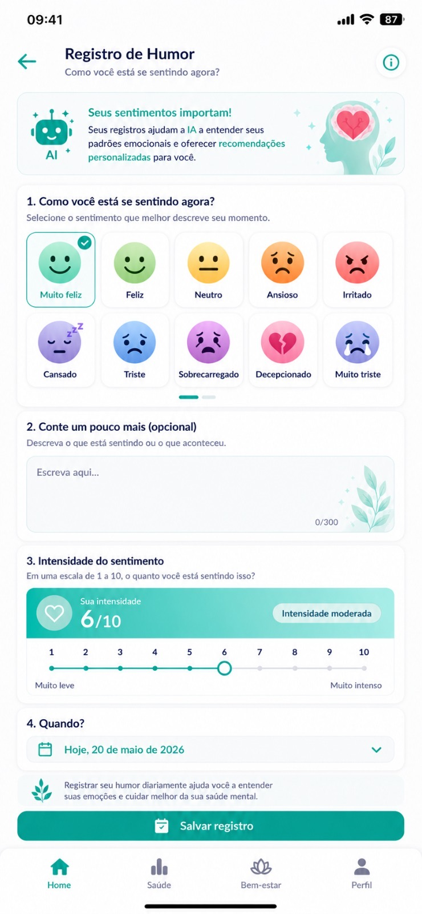
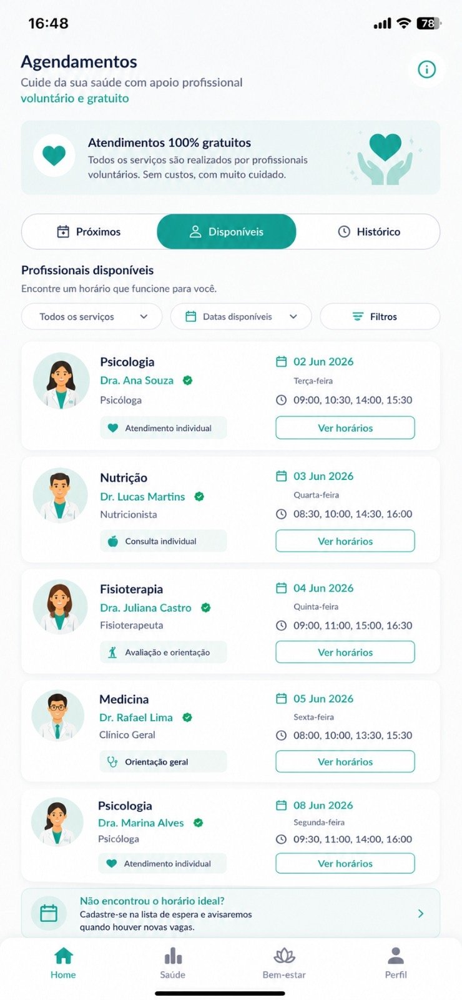
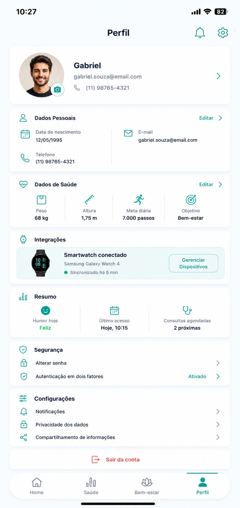

# Mind&Health
O **Mind&Health** nasceu como um projeto na faculdade com um objetivo bem claro: cuidar da saúde de forma completa, integrando o bem-estar mental e físico numa única plataforma. A ideia é conectar pessoas que precisam de apoio a profissionais da área (como psicólogos e psiquiatras) e, ao mesmo tempo, dar ferramentas para o dia a dia, como monitorização de humor com IA e ligação com smartwatches.

Este repositório guarda a "inteligência" por trás disso tudo: a **modelação do nosso banco de dados em SQL** e toda a parte estrutural de **Engenharia de Software**.

---

## 🚀 Como o sistema funciona na prática?

Desenhámos o projeto a pensar no percurso real do utilizador, dividindo a lógica em três grandes blocos:
1. **Segurança e Perfis:** Uma estrutura para que pacientes, médicos e administradores naveguem na plataforma com total privacidade e perfis bem definidos.
2. **Consultas sem complicação:** Toda a lógica para procurar profissionais de saúde, ver horários disponíveis e agendar ou desmarcar consultas de forma simples.
3. **Apoio no dia a dia:** Funcionalidades para que o paciente registe como se sente entre as consultas, gerando um histórico emocional completo.

---

## 💾 O Banco de Dados (SQL)

O ficheiro `MindHealthcodigo.sql` é o script pronto a rodar que cria toda a estrutura da nossa base de dados relacional. Preocupámo-nos muito em normalizar as tabelas para garantir que o sistema seja rápido e que os dados fiquem seguros e bem relacionados.

### O que encontras modelado no código:
* **Controlo de Acesso:** Tabelas de `usuarios`, `profissionais` e dados de segurança.
* **Coração do Negócio:** Toda a parte de `agendamentos`, `consultas` e o fluxo de `pagamentos`.
* **Acompanhamento:** Histórico de sentimentos (`humor_registros`), `metas_usuario` e áreas de `conteudos`.
* **Interação:** Sistema de `notificacoes`, `comentarios`, `posts`, `mensagens` no chat e `avaliacoes` dos médicos.

---

## 📊 A Cara do Projeto (Wireframes)

Antes de começar a escrever o código, passámos bastante tempo a desenhar o fluxo das telas (UX/UI) para garantir que o sistema fosse super intuitivo. Das várias telas que criámos, estas três são as que melhor mostram a inovação do MindHealth:

###  1. Registo de Humor com Inteligência Artificial
Aqui é onde o utilizador anota como se sente no dia a dia. O sistema usa IA para analisar estes desabafos e gerar relatórios inteligentes sobre a evolução do bem-estar emocional.

###  2. Escolha de Consultas e Horários
Um painel limpo e direto para o paciente pesquisar psicólogos ou psiquiatras e ver, em tempo real, quais os horários que estão livres para marcação.

###  3. Integração com Relógios Inteligentes (Smartware)
O perfil do utilizador vai além das consultas: conecta-se a dispositivos vestíveis para cruzar dados de saúde física (como batimentos cardíacos ou sono) com a saúde mental.

---

## 👥 Quem desenvolveu o projeto

Este ecossistema foi construído com muito trabalho de equipa e dedicação durante os nossos estudos práticos de Engenharia de Software e Banco de Dados na UMC (Universidade de Mogi das Cruzes):

* **Rayane Fernandes da Costa** 
* **Gabriel Alexandre do Nascimento da Silva**
* **Mateus Vicente Faria Costa**
* **Rafael Silva Lima**
* **Raphael Lerch Soares**
* **Victor de Freitas Pellegrinelli**
